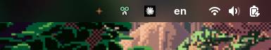
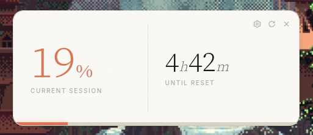

<div align="center">

# Claude Hourglass

A tray app with a popup window and global shortcut for live Claude session usage.

[](#license)
[](https://tauri.app)



<br />



</div>

---

## What it does

Lives in your system tray. Click the icon — or hit your bound keyboard
shortcut — and a small popup window shows the same numbers
`claude.ai/settings/usage` shows: current 5-hour session percent and
time until reset. Auto-refreshes every minute while open.

Sourced directly from claude.ai's own internal usage endpoint, so the
percent matches the dashboard exactly.

## Install

Download the latest artifact from
[**Releases**](https://github.com/AbdullahAlattar/claude-hourglass/releases),
then:

```sh
# Fedora / RHEL
sudo dnf install ./claude-hourglass-*.x86_64.rpm

# Ubuntu / Debian
sudo apt install ./claude-hourglass_*_amd64.deb
```

> **GNOME users:** the tray icon needs the
> [AppIndicator and KStatusNotifierItem Support](https://extensions.gnome.org/extension/615/appindicator-support/)
> extension.

## First-run setup

The popup launches with **Not connected**. Click the gear icon and paste
your Claude session cookie:

1. Open <https://claude.ai> in your browser, log in.
2. DevTools (`F12`) → **Application** tab → **Cookies** → `https://claude.ai`.
3. Click `sessionKey`. Copy the **Value** (starts with `sk-ant-sid01-…`).
4. Paste into the popup. Save.

The cookie is stored at `~/.config/claude-hourglass/config.json`
(mode `0600`, atomic write). It never leaves your machine except to
claude.ai itself. Sign out of claude.ai or click **Disconnect** to revoke.

## Keyboard shortcut

Bind a keyboard shortcut in your desktop environment to toggle the
popup — point it at the binary with `--toggle`:

```
/usr/bin/claude-hourglass --toggle
```

<details>
<summary><b>GNOME</b></summary>

`Settings → Keyboard → View and Customize Shortcuts → Custom Shortcuts → +`

| Field | Value |
|---|---|
| Name | Claude Hourglass |
| Command | `/usr/bin/claude-hourglass --toggle` |
| Shortcut | any free combo (e.g. <kbd>Ctrl</kbd>+<kbd>Alt</kbd>+<kbd>L</kbd>) |
</details>

<details>
<summary><b>KDE Plasma</b></summary>

`System Settings → Shortcuts → Add Application → Custom`

| Field | Value |
|---|---|
| Action | `/usr/bin/claude-hourglass --toggle` |
| Trigger | any free combo |
</details>

<details>
<summary><b>XFCE</b></summary>

`Settings → Keyboard → Application Shortcuts → Add`

| Field | Value |
|---|---|
| Command | `/usr/bin/claude-hourglass --toggle` |
| Shortcut | any free combo |
</details>

CLI flags supported: `--toggle`, `--show`, `--hide`.

## Auto-start at login

Save the following as `~/.config/autostart/claude-hourglass.desktop`.
This is the freedesktop XDG Autostart format — works on GNOME, KDE,
XFCE, Cinnamon, MATE, and any other freedesktop-compliant DE.

```ini
[Desktop Entry]
Type=Application
Name=Claude Hourglass
Exec=/usr/bin/claude-hourglass
```

## Build from source

```sh
# Fedora prerequisites
sudo dnf install \
  webkit2gtk4.1-devel librsvg2-devel libappindicator-gtk3-devel \
  openssl-devel gcc gcc-c++ make

# Ubuntu prerequisites
sudo apt install \
  libwebkit2gtk-4.1-dev librsvg2-dev libayatana-appindicator3-dev \
  build-essential libssl-dev

git clone https://github.com/AbdullahAlattar/claude-hourglass
cd claude-hourglass
npm install
npm run tauri build       # release artifacts in src-tauri/target/release/bundle/
npm run tauri dev         # development run
```

Requires Rust 1.77+ and Node 18+.

## Platform support

| Platform | Status |
|---|---|
| Linux (Fedora, Ubuntu, KDE, GNOME) | Tested |
| macOS | Untested — PRs welcome |
| Windows | Untested — PRs welcome |

## Known limitations

- **Wayland window positioning**: GNOME's compositor decides where the
  popup appears (xdg-shell forbids apps from positioning their own
  toplevels). On X11/KDE the bottom-right anchor works.
- **Cookie expires** when you sign out of claude.ai. Re-paste from the
  gear icon when that happens.
- **Unofficial endpoint**: see Disclaimer below.

## Contributing

See [CONTRIBUTING.md](CONTRIBUTING.md). Bug reports, platform fixes
(macOS/Windows), and resilience to claude.ai endpoint changes are all
welcome. Don't expect feature creep — the popup is intentionally
single-glance.

## Disclaimer

> This is an unofficial third-party tool. **Not affiliated with,
> endorsed by, or supported by Anthropic.** "Claude" is a trademark of
> Anthropic.
>
> Claude Hourglass reads from a non-public Claude endpoint
> (`/api/organizations/{org_id}/usage`) using your session cookie — the
> same one your browser uses. Anthropic could change or remove this
> endpoint without notice; the app would break until updated. Use at
> your own risk.

## License

Dual-licensed under either of

- Apache License, Version 2.0 ([LICENSE-APACHE](LICENSE-APACHE))
- MIT license ([LICENSE-MIT](LICENSE-MIT))

at your option.

Unless you explicitly state otherwise, any contribution intentionally
submitted for inclusion in the work by you, as defined in the Apache-2.0
license, shall be dual-licensed as above, without any additional terms
or conditions.
